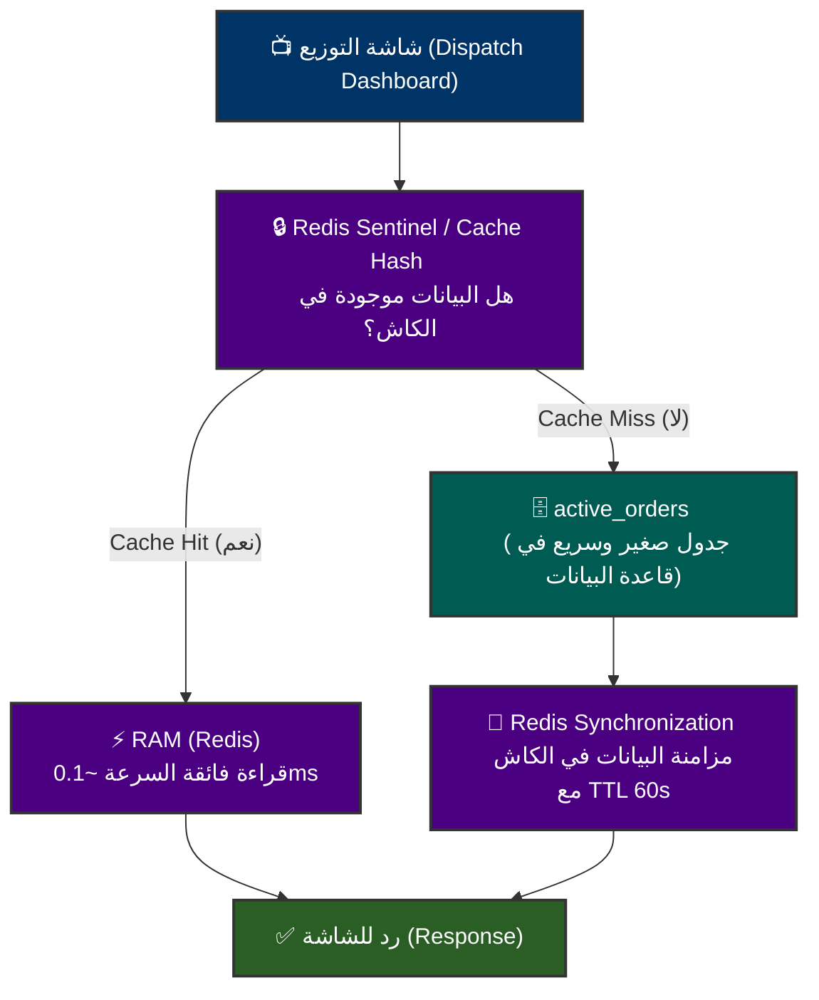
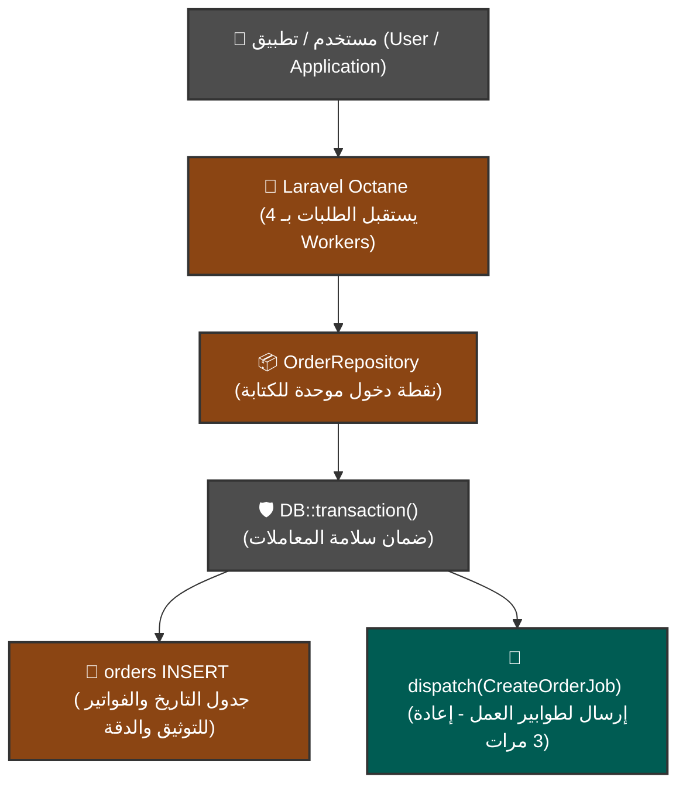

# 🚚 دليل نظام الإسناد الجغرافي الذكي وتوزيع الطلبات (Winch Dispatch System)

مرحباً بك في الدليل الفني الشامل للمشروع. تم بناء هذا النظام باستخدام أحدث المعايير الهندسية ومعمارية البرمجيات المتقدمة لضمان الكفاءة القصوى، السرعة الفائقة، وتحمل الضغط العالي (High-Throughput) في تطبيقات الخدمات اللوجستية وتوصيل الشحنات.

---

## 🏗️ المخططات المعمارية الفنية (System Architecture Diagrams)

لقد قمنا بنمذجة مسارات النظام البرمجية من خلال مخططات تفاعلية توضح بدقة كيف تتم معالجة البيانات بكفاءة عالية في القراءة والكتابة:

### 1️⃣ مسار القراءة - شاشة التوزيع (Read Path - Dispatch Dashboard)
يوضح هذا المخطط كيف يعتمد النظام على مبدأ **CQRS** لتقليل الضغط على قاعدة البيانات الكلاسيكية والاعتماد على الذاكرة المؤقتة الذكية بمعدل استجابة يقل عن جزء من الملي ثانية.



### 2️⃣ مسار الكتابة - استقبال وإدخال الطلبات (Write Path - Order Ingestion)
يوضح هذا المخطط تدفق عملية إنشاء طلب جديد، واستخدام خادم Octane عالي الأداء مع معالجة غير متزامنة بالكامل عبر طوابير عمل Redis.



---

## 🚀 دليل تشغيل النظام بالتفصيل (Project Running Guide)

اتبع الخطوات التالية لتشغيل جميع مكونات النظام في البيئة المحلية:

### 1️⃣ المتطلبات الأساسية (Prerequisites)
*   **PHP:** إصدار `8.3` أو أحدث.
*   **Node.js:** إصدار `18` أو أحدث مع مدير الحزم `npm`.
*   **Composer** لإدارة حزم PHP الخلفية.
*   **Redis Server:** يعمل محلياً كجزء من بيئة **Laragon** على المنفذ الافتراضي `6379`.

### 2️⃣ إعداد البيئة وتثبيت الاعتماديات
```bash
# 1. تثبيت حزم PHP الخلفية
composer install

# 2. إنشاء ملف الإعدادات البيئية وتوليد مفتاح التشفير
copy .env.example .env
php artisan key:generate

# 3. تثبيت حزم الواجهة الأمامية Vue 3
npm install
```

### 3️⃣ ضبط البيئة للاتصال بقاعدة البيانات و Redis
تأكد من تحديث المتغيرات التالية في ملف الـ `.env`:
```env
DB_CONNECTION=sqlite
# أو يمكنك استخدام MySQL كالتالي بعد إنشاء قاعدة باسم wins:
# DB_CONNECTION=mysql
# DB_HOST=127.0.0.1
# DB_PORT=3306
# DB_DATABASE=wins
# DB_USERNAME=root
# DB_PASSWORD=

# إعدادات طوابير العمل والتخزين المؤقت
QUEUE_CONNECTION=redis
CACHE_STORE=redis
REDIS_HOST=127.0.0.1
REDIS_PORT=6379

# إعدادات بث الويب سوكت اللحظي Reverb
BROADCAST_CONNECTION=reverb
```

### 4️⃣ تهجير الجداول وبناء البيانات الافتراضية
```bash
# بناء الجداول وتغذية قاعدة البيانات بالسائقين والطلبات الوهمية
php artisan migrate:fresh --seed
```

### 5️⃣ تشغيل خوادم التطبيق وطوابير العمل (الأوامر الأساسية)

لتشغيل المشروع بأكمله بكفاءة، افتح نوافذ سطر الأوامر التالية وشغّل كل منها على حدة:

#### أ. تشغيل خادم الويب والمطورين (Laravel & Vite):
```bash
# لتشغيل خادم المطورين بشكل موحد
composer dev
```

#### ب. تشغيل خادم بث الويب سوكت (Laravel Reverb):
تُستخدم حزمة **Laravel Reverb** كخادم بث WebSocket فائق السرعة مدمج داخل Laravel لتحديث الواجهة تلقائياً وبشكل حي:
```bash
php artisan reverb:start --debug
```
> [!NOTE]
> **وظيفة Reverb في المشروع:** تقوم الحزمة بنقل التحديثات الحية من الخلفية (مثل أحداث `OrderAssignedEvent`) فور حدوثها وبثها للوحة التحكم. هذا يضمن تحديث خريطة السائقين وحالة الشحنات لحظة بلحظة دون حاجة المتصفح لإرسال طلبات متكررة (Polling).

#### ج. تشغيل مشغل الطوابير والمراقبة الجغرافية (Redis Queue Worker):
لتشغيل معالجة الطلبات وإدخالها غير المتزامن باستخدام طابور العمل المخصص للمشروع:
```bash
php artisan queue:work redis --queue=orders-ingestion --tries=3 --backoff=5
```
> [!IMPORTANT]
> **تفاصيل المعاملات البرمجية للأمر:**
> *   `redis`: استخدام محرك Redis فائق السرعة لإدارة الطوابير في الذاكرة.
> *   `--queue=orders-ingestion`: توجيه الـ Worker للاستماع تحديداً للطلبات الجديدة الواردة عبر هذا الأنبوب المخصص لضمان استهلاك منظم وعادل للبيانات.
> *   `--tries=3`: في حال حدوث أي فشل مؤقت (مثل بطء شبكة أو قفل قاعدة بيانات)، يقوم النظام بإعادة تشغيل المهمة حتى 3 مرات قبل نقلها لجدول المهام الفاشلة.
> *   `--backoff=5`: يمنع المحاولة الفورية للفشل عن طريق إعطاء مهلة 5 ثوانٍ بين كل محاولة إعادة، مما يمنح الموارد وقتاً للاستقرار والتخلص من الازدحام.

---

## 🛠️ تفاصيل وتحليل هندسة النظام (Technical Architecture Overview)

أجبنا هنا على أهم الأسئلة الهندسية التي توضح متانة وتفوق المعمارية المطبقة داخل المشروع:

### ❓ ماذا يحدث في الحالات التالية؟

#### 1️⃣ تم عمل إسناد أكثر من طلب لنفس السائق في نفس الوقت؟
*   **المشكلة:** قد تتداخل طلبات إسناد الشحنات بسبب استدعاءات متزامنة من خوادم متعددة (Race Condition)، مما قد يؤدي لإسناد طلبين مختلفين لسائق واحد متاح وتشتيت العمليات.
*   **الحل الهندسي:** تم حل المشكلة بشكل قاطع وجذري باستخدام **الأقفال المتشائمة (Pessimistic Locking)** على مستوى قاعدة البيانات.
*   **التطبيق البرمجي:** داخل الخدمة `AssignOrderService.php`:
    *   يتم تغليف العملية بالكامل داخل معاملة واحدة `DB::transaction(...)`.
    *   يتم سحب السائق المختار وقفل السجل الخاص به فوراً باستخدام ميزة `lockForUpdate()` في Eloquent.
    *   تمنع هذه التعليمة أي خادم آخر أو Worker آخر من قراءة أو تحديث بيانات هذا السائق حتى تنتهي المعاملة الحالية تماماً (Commit) وتتغير حالته إلى "غير متاح". أي عملية موازية ستنتظر في الطابور تلقائياً حتى يتم الإفراج عن القفل.

#### 2️⃣ تم عمل تحديد للمنطقة الجغرافية لكي يسهل البحث؟
*   **الآلية:** تم تقسيم وضبط عمليات البحث جغرافياً لتجنب فحص مساحات غير منطقية وحساب مسافات هائلة.
*   **التطبيق البرمجي:**
    *   **محاكاة Riyadh Bounding Box:** في دالة المحاكاة `simulateIncomingOrder` يتم توليد الطلبات تلقائياً ضمن نطاق مدينة الرياض الحقيقي بدقة:
        *   Latitude: `24.6500` إلى `24.7900`
        *   Longitude: `46.6500` إلى `46.7900`
    *   **البحث القريب المتخصص:** عند البحث عن سائق، لا يتم البحث بشكل أعمى، بل يتم الاعتماد على صيغ حساب المسافات الفضائية الرياضية `ST_Distance_Sphere` لحساب المسافة الفضائية الدقيقة بين السائق وإحداثيات الطلب بشكل فوري داخل الاستعلام وبث السائقين الأقرب فقط وترتيبهم تصاعدياً.

#### 3️⃣ تم استخدام مبدأ CQRS في فصل القراءة عن الكتابة في الطلبات؟
*   **الآلية:** قمنا بفصل مسار العمليات التي تقوم بالتغيير والكتابة في النظام (Commands) عن مسار الاستعلام وعرض البيانات (Queries) لتوفير أداء لا يضاهى:
    *   **الكتابة (Write):** تتم العمليات المعقدة من إنشاء طلبات أو ربط سائقين داخل قاعدة البيانات التقليدية (SQL) لضمان اتساق البيانات وسلامتها تحت حماية المعاملات `DB::transaction`.
    *   **القراءة (Read):** شاشة التوزيع وقوائم المراقبة يتم استعراضها مباشرة من كتل الذاكرة المؤقتة الذكية فائقة السرعة في Redis (`active_orders` Hash) والتي توفر زمن استجابة `0.1ms`. وفي حال عدم وجود البيانات (Cache Miss)، يتم الاتجاه لجدول عمل صغير وخفيف جداً مخصص للطلبات النشطة فقط `active_orders` ومن ثم إعادة تعبئة الكاش فوراً.

#### 4️⃣ تم استخدام DTO للداتا؟
*   **الآلية:** تم استخدام كتل **Data Transfer Objects** (عبر كلاس `OrderData`) كوعاء بيانات نظيف، متماسك ومقاوم للأخطاء لنقل مدخلات المستخدم من طبقة العرض (Controllers) إلى طبقة العمليات (Domain Services).
*   **الفوائد:**
    *   يمنع تماماً تمرير مصفوفات عشوائية (Raw Arrays) قد تسبب أخطاء عدم تطابق الحقول.
    *   يوفر نوعية بيانات قوية (Type-Safe Types) لتسهيل الفحص والصيانة.
    *   يفصل هيكل قواعد البيانات الداخلي عن مدخلات المستخدم الخارجية تماماً.

#### 5️⃣ تم استخدام معمارية DDD (Domain-Driven Design)؟
*   **الآلية:** بناءً على طبيعة الأنظمة اللوجستية التي تتميز بتعقيد قواعد العمل وتغيرها المستمر، تم تطبيق تصميم DDD الموجه للدومين في مجلد `src`:
    *   تقسيم المشروع لـ Bounded Contexts مستقلة مثل دومين الطلبات (`Domain/Orders`) ودومين السائقين (`Domain/Driver`).
    *   وضع كل منطق العمل، الكيانات (Entities)، الأحداث (Domain Events)، المخازن (Repositories)، ووظائف الطوابير (Jobs) داخل حدود الدومين الخاص بها، مما يجعل النظام قابلاً للتوسع وإعادة الاستخدام ومقاوم للتآكل البرمجي.

#### 6️⃣ تم استخدام Redis؟
*   **الآلية:** يلعب Redis الدور الرئيسي في تسريع الاستجابة كونه:
    *   مستودع كاش للقراءة الفورية لعناصر التوزيع النشطة.
    *   وسيط رسائل وطوابير (Message Broker) سريع جداً للتعامل مع الطلبات المتدفقة بكثافة.

#### 7️⃣ تم إعداد وتثبيت Redis داخل بيئة Laragon؟
*   **الآلية:** لتسهيل بيئة التطوير المحلية، تم دمج وتفعيل خادم Redis للعمل كخلفية مستقرة مع Laragon، مما يضمن توافقية ومحاكاة كاملة لبيئة الإنتاج الحقيقية دون تعقيدات تشغيل إضافية.

---

## ❓ لماذا لم نقم باستخدام فهارس قواعد البيانات (Indexes) في SQL؟

سؤال ذكي ويُظهر تفكيراً هندسياً عميقاً يوازن بين "تكلفة" و"منفعة" كل قرار تقني. الإجابة المختصرة هي: **الفهارس (Indexes) ليست "شريرة"، لكنها "خدمة مكلفة جداً" لا نريد دفع ثمنها في مرحلة الكتابة السريعة والمتكررة.**

إليك تفصيل علمي للسبب:

### 1. تكلفة الكتابة الفائقة (Write Amplification)
كل فهرس تقوم بإنشائه على الجدول هو في الحقيقة **بناء بيانات إضافي (غالباً B-Tree)**.
*   عندما تقوم بكتابة `INSERT` لطلب جديد، قاعدة البيانات لا تكتب فقط البيانات في الجدول الأساسي، بل يجب عليها فتح كل فهرس مسجل، البحث عن مكانه الأبجدي أو الرقمي، وتحديث هيكل الشجرة.
*   إذا كان لديك 5 فهارس على جدول عالي الكتابة، فأنت تحوّل عملية كتابة واحدة إلى **6 عمليات كتابة وتعديل**. في نظام لوجستي يستقبل آلاف الطلبات المتزامنة، هذا العبء الإضافي يخنق أداء المعالج ويسبب بطء واضح في عمليات الإدخال.

### 2. ضغط الذاكرة العشوائية (Memory Pressure)
الفهارس تتطلب تخزيناً دائماً في الذاكرة العشوائية (RAM) لتكون مفيدة. في الأنظمة التي تحتوي ملايين السجلات، تكبر الفهارس لدرجة تجعلها لا تتسع في الذاكرة المتاحة للخادم، مما يضطر محرك قاعدة البيانات لاستخدام القرص الصلب (Disk I/O) لقراءة الفهرس، وهذا هو الموت البطيء لأي نظام عالي الأداء.

### 3. لماذا تصميمنا البرمجي لا يحتاج للفهارس؟
في المعمارية التي صمّمناها (Active Table + Redis)، قمنا **بنقل ذكي للفهرسة** من مكان مكلف وبطيء (SQL Disk) إلى مكان رخيص وفائق السرعة (In-Memory Redis):
*   **في SQL:** نحن لا نبحث في جدول الملايين للحصول على لوحة التوزيع الحية. قمنا بإنشاء جدول مصغر ونشط جداً وهو `active_orders` (يحتوي فقط على الطلبات قيد التوصيل، بحدود 5,000 سجل على الأكثر). محرك قاعدة البيانات يستطيع عمل مسح كامل للجدول (Full Table Scan) في أجزاء ضئيلة من الملي ثانية لأن الجدول بأكمله مستقر مسبقاً في كاش قاعدة البيانات (Buffer Pool). الفهرس هنا لن يقدم فارقاً يُذكر وسيتسبب ببطء الكتابة بلا داعٍ.
*   **في Redis:** نستخدم هياكل بيانات مثل `Hashes` و `Sets`. هذه الهياكل بطبيعتها فهارس حية في الذاكرة (In-Memory Indexes). قمنا بالفهرسة الحية للطلبات النشطة والسائقين مباشرة في الذاكرة، وهي أسرع بآلاف المرات من فهارس الـ SQL التقليدية.

> [!TIP]
> **متى نضطر لاستخدام الفهرس؟ (الاستثناء الوحيد):**
> سنحتاج لإنشاء فهارس فقط في حال اضطررنا للبحث التاريخي المعقد في جداول الملايين المؤرشفة (مثل شاشات التقارير والتحليلات التاريخية). وفي هذا السيناريو، يتم عمل فهارس متخصصة ومخصصة للقراءة فقط (Read-Only Indexes) على خادم نسخ احتياطي منفصل (Read Replica) حتى لا نؤثر نهائياً على أداء خادم الكتابة والاستقبال الرئيسي.

---

## 🔮 لو كان لدينا متسع من الوقت (Future Scalability Roadmap)

نظراً لالتزامات عمل أخرى على مشاريع متعددة بالتوازي، تم تقديم هذا الحل كأفضل نموذج معماري محلي فائق السرعة. ولكن، لو اتسع الوقت مستقبلاً، فإن خارطة الطريق لتوسيع النظام للخدمة العالمية تشمل:

1.  **بيئة عمل معزولة بالكامل (Docker Integration):**
    *   بناء النظام باستخدام حاويات Docker لتسهيل النقل والتشغيل الفوري في أي خادم دون القلق من إعدادات البيئة المحلية.
2.  **فصل العقد والخدمات (Node Decentralization):**
    *   توزيع النظام على خوادم ونقاط منفصلة ومستقلة:
        *   نود مخصصة لخادم قواعد البيانات MySQL/PostgreSQL.
        *   نود مخصصة للـ Redis Cluster (كاش وطوابير).
        *   نود مخصصة لتشغيل الـ Workers (Worker Nodes) لمعالجة المهام الخلفية بشكل مكثف دون مشاركة موارد خادم الويب.
3.  **موازنة الأحمال والتوسع الديناميكي (Load Balancer & Auto-Scaling):**
    *   دمج موازن أحمال (مثل Nginx أو AWS ALB) لتوزيع طلبات المستخدمين بالتساوي على واجهات خوادم متعددة، ووضع سياسات توسع تلقائي تزيد من عدد حاويات الويب والـ Workers تلقائياً مع ارتفاع ضغط الطلبات.
